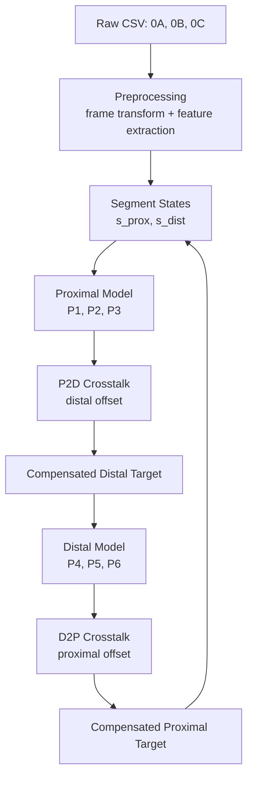

# IK Soft Recursive

Code and example data for recursive inverse kinematics and crosstalk compensation in a two-segment soft manipulator.

This repository contains preprocessing, training, and inference code for segment-wise pressure prediction and recursive segment-wise crosstalk compensation (RSCC). The current codebase includes:
- proximal pressure mapping
- distal pressure mapping
- proximal-to-distal crosstalk-related modeling
- RSCC pressure generation for two-segment execution

---

## Overview

Soft continuum manipulators with morphable chambers exhibit hysteresis and inter-segment coupling.  
This repository implements a recursive pipeline that combines:
- **segment-wise inverse pressure models**
- **crosstalk-related compensation models**
- **iterative pressure generation for multi-segment control**

The repository is organized to support:
1. raw log preprocessing
2. model training
3. pretrained model loading
4. RSCC pressure generation and testing

---

## Repository Layout

| Path | Description |
|---|---|
| `environment.yml` | Conda environment for preprocessing, training, and inference |
| `Data_sep/` | Dataset builders that convert raw logs into processed datasets |
| `Train_code/` | Training scripts for proximal, distal, and crosstalk-related models |
| `RSCC_pressuregen/` | RSCC inference / pressure generation scripts |
| `Trained_models/` | Pretrained model checkpoints |
| `Example_data/raw_data/` | Example raw sensor logs |
| `Example_data/process_data/` | Example processed datasets |
| `RAL_2025_ML_Hysteresis_Crosstalk_SoftMani_Re1_submitted_main.pdf` | Paper PDF |
| `docs/paper_details.md` | Detailed summary of the paper and how the repository maps to it |
| `docs/data_format.md` | Detailed raw-data and processed-data specification |

---

## Quick Start

### 1. Create the environment

```bash
conda env create -f environment.yml
conda activate torchenv
```

### 2. Prepare data

Run the preprocessing scripts in `Data_sep/` to convert raw CSV logs into processed datasets.

Typical outputs include:
- processed data in `.npz`
- normalization statistics in `.npz`
- inspection tables in `.csv`

### 3. Train models

Run the training scripts in `Train_code/` for:
- proximal pressure mapping
- distal pressure mapping
- crosstalk-related models

### 4. Run RSCC pressure generation

Use the scripts in `RSCC_pressuregen/` to generate pressure commands using the trained models.

---

## RSCC Control Pipeline



The RSCC pipeline performs recursive compensation between the proximal and distal segments.  
Initial pressure commands are estimated by the segment-wise models, crosstalk effects are predicted, and the segment states are updated iteratively.

---

## Data Format

A short summary is given below.  
For the full specification, see [`docs/data_format.md`](docs/data_format.md).

### Raw log requirement

The preprocessing scripts expect a raw `.csv` log containing:
- timestamp
- chamber pressures
- stiffness-related index
- three tracked sensor streams with position and quaternion orientation

### Required columns

| Column group | Required columns |
|---|---|
| Time | `time` |
| Pressure | `p1`, `p2`, `p3`, `p4`, `p5`, `p6` |
| Index | `ks` |
| 0A pose | `0A_pos_x`, `0A_pos_y`, `0A_pos_z`, `0A_orient_x`, `0A_orient_y`, `0A_orient_z`, `0A_orient_w` |
| 0B pose | `0B_pos_x`, `0B_pos_y`, `0B_pos_z`, `0B_orient_x`, `0B_orient_y`, `0B_orient_z`, `0B_orient_w` |
| 0C pose | `0C_pos_x`, `0C_pos_y`, `0C_pos_z`, `0C_orient_x`, `0C_orient_y`, `0C_orient_z`, `0C_orient_w` |

### Example raw row (split view)

**Time and pressure**

| time | p1 | p2 | p3 | p4 | p5 | p6 | ks |
|---:|---:|---:|---:|---:|---:|---:|---:|
| 1762606570 | 0 | 0 | 0 | 0 | 0 | 0 | 0 |

**Sensor 0A**

| 0A_pos_x | 0A_pos_y | 0A_pos_z | 0A_orient_x | 0A_orient_y | 0A_orient_z | 0A_orient_w |
|---:|---:|---:|---:|---:|---:|---:|
| 15.3788 | 29.1995 | -210.7228 | -0.6118 | 0.0277 | 0.0000 | 0.7905 |

**Sensor 0B**

| 0B_pos_x | 0B_pos_y | 0B_pos_z | 0B_orient_x | 0B_orient_y | 0B_orient_z | 0B_orient_w |
|---:|---:|---:|---:|---:|---:|---:|
| -5.9536 | -49.4013 | -217.9330 | -0.7429 | 0.0555 | 0.0822 | 0.6620 |

**Sensor 0C**

| 0C_pos_x | 0C_pos_y | 0C_pos_z | 0C_orient_x | 0C_orient_y | 0C_orient_z | 0C_orient_w |
|---:|---:|---:|---:|---:|---:|---:|
| 14.5586 | 3.9051 | -217.2526 | -0.6361 | -0.0203 | 0.0000 | 0.7713 |

---

## Model Input Summary

### Proximal pressure model

```text
[PX, PY, cosP, sinP, dPX, dPY, dcosP, dsinP] -> [P1, P2, P3]
```

### Distal pressure model

```text
[PX, PY, cosP, sinP, dPX, dPY, dcosP, dsinP] -> [P4, P5, P6]
```

### P2D response model

```text
[P1, P2, P3] -> [X, Y]
```

### D2P response model

```text
[P4, P5, P6] -> [X, Y]
```

---

## Example Workflow

```text
Raw CSV
→ Data_sep preprocessing
→ processed .npz / .csv
→ Train_code model training
→ Trained_models checkpoints
→ RSCC_pressuregen inference
```

---

## Citation

If you use this repository, please cite both the code repository and the accompanying paper.

### Repository citation

A `CITATION.cff` file is provided in the repository root so GitHub can display a citation entry automatically.

### Paper citation

Please cite the accompanying manuscript:

```bibtex
@misc{korn_soft_recursive,
  title        = {Data-Efficient Modeling of Hysteresis and Crosstalk for Inverse Kinematics of Soft Continuum Robots},
  author       = {Korn Borvornatanajanya and collaborators},
  year         = {2026},
  note         = {RAL submission / manuscript included in repository},
}
```

Update the BibTeX entry above once the final publication details, pages, and DOI are available.

---

## Paper and Documentation

- Paper PDF: `RAL_2025_ML_Hysteresis_Crosstalk_SoftMani_Re1_submitted_main.pdf`
- Detailed paper notes: [`docs/paper_details.md`](docs/paper_details.md)
- Detailed data specification: [`docs/data_format.md`](docs/data_format.md)

---

## License

This project is released under the MIT License. See [`LICENSE`](LICENSE).

---

## Contact

For questions related to the repository, models, or paper, please open an issue or contact the repository author.
