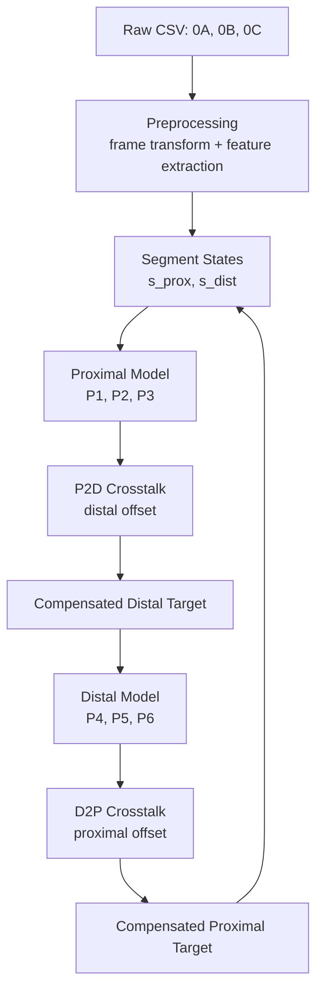

# IK Soft Recursive

Code and example data for recursive inverse kinematics and crosstalk compensation in a two-segment soft manipulator.

This repository contains preprocessing, training, and inference code for segment-wise pressure prediction and recursive segment-wise crosstalk compensation (RSCC). The current codebase includes:
- proximal pressure mapping
- distal pressure mapping
- proximal-to-distal crosstalk-related modeling
- RSCC pressure generation for two-segment execution

---

## Overview

Soft continuum manipulators with morphable chambers exhibit hysteresis and inter-segment coupling.  
This repository implements a recursive pipeline that combines:
- **segment-wise inverse pressure models**
- **crosstalk-related compensation models**
- **iterative pressure generation for multi-segment control**

The repository is organized to support:
1. raw log preprocessing
2. model training
3. pretrained model loading
4. RSCC pressure generation and testing

For detailed paper notes, see [`docs/paper_details.md`](docs/paper_details.md).  
For detailed raw-data and processed-data format, see [`docs/data_format.md`](docs/data_format.md).

---

## Repository Layout

| Path | Description |
|---|---|
| `environment.yml` | Conda environment for preprocessing, training, and inference |
| `Data_sep/` | Dataset builders that convert raw logs into processed datasets |
| `Train_code/` | Training scripts for proximal, distal, and crosstalk-related models |
| `RSCC_pressuregen/` | RSCC inference / pressure generation scripts |
| `Trained_models/` | Pretrained model checkpoints |
| `Example_data/raw_data/` | Example raw sensor logs |
| `Example_data/process_data/` | Example processed datasets |
| `docs/paper_details.md` | Detailed summary of the paper and how the repository maps to it |
| `docs/data_format.md` | Detailed raw-data and processed-data specification |
| `RAL_2025_ML_Hysteresis_Crosstalk_SoftMani_Re1_submitted_main.pdf` | Paper PDF |

---

## Quick Start

### 1. Create the environment

```bash
conda env create -f environment.yml
conda activate torchenv
```

### 2. Prepare data

Run the preprocessing scripts in `Data_sep/` to convert raw CSV logs into processed datasets.

Typical outputs include:
- processed training data in `.npz`
- normalization statistics in `.npz`
- inspection tables in `.csv`

### 3. Train models

Run the training scripts in `Train_code/` to train:
- proximal pressure mapping model
- distal pressure mapping model
- crosstalk-related models

Trained models are typically saved as `.pth` checkpoints.

### 4. Run RSCC pressure generation

Use the scripts in `RSCC_pressuregen/` together with trained `.pth` models to generate pressure commands for two-segment control.

---

## End-to-End Workflow

The typical workflow in this repository is:

```text
Raw CSV log
→ Data_sep preprocessing
→ segment-level processed dataset
→ normalized input/output training data
→ Train_code model training
→ saved model checkpoint (.pth)
→ RSCC_pressuregen inference / pressure generation
```

### Example data flow

```text
Example_data/raw_data/
    ↓
Data_sep/
    ↓
Example_data/process_data/ or generated processed files
    ↓
Train_code/
    ↓
Trained_models/*.pth
    ↓
RSCC_pressuregen/
```

### Example model usage flow

```text
raw sensor log
→ preprocess into local segment features
→ build model input/output pairs
→ normalize data
→ train model
→ save trained weights (.pth)
→ load trained model
→ generate pressure output
```

---

## RSCC Control Pipeline



The RSCC pipeline performs recursive compensation between the proximal and distal segments.  
Initial pressure commands are estimated by the segment-wise models, crosstalk effects are predicted, and the segment states are updated iteratively.

---

## Model Summary

### Proximal pressure model

```text
[PX, PY, cosP, sinP, dPX, dPY, dcosP, dsinP] -> [P1, P2, P3]
```

### Distal pressure model

```text
[PX, PY, cosP, sinP, dPX, dPY, dcosP, dsinP] -> [P4, P5, P6]
```

### P2D response model

```text
[P1, P2, P3] -> [X, Y]
```

### D2P response model

```text
[P4, P5, P6] -> [X, Y]
```

For the full raw-data format, processed dataset format, and model I/O details, see [`docs/data_format.md`](docs/data_format.md).

---

## Suggested Usage Order

For a new user of the repository, the recommended order is:

1. Read this `README.md`
2. Check [`docs/paper_details.md`](docs/paper_details.md)
3. Check [`docs/data_format.md`](docs/data_format.md)
4. Start from `Example_data/raw_data/`
5. Run preprocessing in `Data_sep/`
6. Train or load models from `Train_code/` and `Trained_models/`
7. Run inference in `RSCC_pressuregen/`

---

## Citation

If you use this repository, please cite both the repository and the accompanying paper.

### Repository citation

A `CITATION.cff` file is provided in the repository root so GitHub can display a citation entry automatically.

### Paper citation

```bibtex
@misc{korn_soft_recursive,
  title        = {Data-Efficient Modeling of Hysteresis and Crosstalk for Inverse Kinematics of Soft Continuum Robots},
  author       = {Korn Borvornatanajanya and collaborators},
  year         = {2026},
  note         = {RAL submission / manuscript included in repository},
}
```

Update this BibTeX entry once the final publication details, pages, and DOI are available.

---

## Paper and Documentation

- Paper PDF: `RAL_2025_ML_Hysteresis_Crosstalk_SoftMani_Re1_submitted_main.pdf`
- Detailed paper notes: [`docs/paper_details.md`](docs/paper_details.md)
- Detailed data specification: [`docs/data_format.md`](docs/data_format.md)

---

## License

This project is released under the MIT License. See [`LICENSE`](LICENSE).

---

## Contact

For questions related to the repository, models, or paper, please open an issue or contact the repository author.
