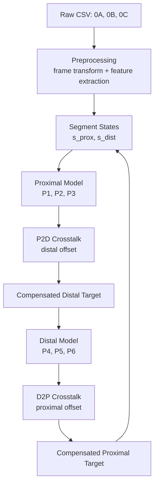

# Paper Details

This document summarizes the motivation, method, repository structure, and practical usage of the accompanying paper and codebase.

---

## 1. Motivation

Soft manipulators with morphable pneumatic chambers can provide compliant motion and improved safety, but they are difficult to control accurately because of:

- hysteresis in pressure-shape behavior
- coupling between segments
- limited data availability for training
- sensitivity to loading and execution history

A direct monolithic inverse model can become data-hungry and difficult to generalize.  
This repository follows a recursive segment-wise strategy to reduce model complexity and improve modularity.

---

## 2. Core idea of the paper

The main idea is to decompose the multi-segment inverse problem into smaller learned components:

1. **Proximal inverse pressure model**  
   predicts proximal pressures from proximal segment features

2. **Distal inverse pressure model**  
   predicts distal pressures from distal segment features

3. **Crosstalk-related models**  
   estimate how actuation of one segment affects the other segment

4. **Recursive Segment-wise Crosstalk Compensation (RSCC)**  
   combines the segment-wise pressure models and crosstalk-related models in an iterative loop

This gives a modular control pipeline that can be trained and tested more efficiently than a fully monolithic model.

---

## 3. Repository-to-paper mapping

| Paper concept | Repository location |
|---|---|
| Raw log preprocessing | `Data_sep/` |
| Proximal / distal model training | `Train_code/` |
| Crosstalk-related training | `Train_code/` |
| RSCC pressure generation | `RSCC_pressuregen/` |
| Pretrained models | `Trained_models/` |
| Example raw data | `Example_data/raw_data/` |
| Example processed data | `Example_data/process_data/` |
| Manuscript PDF | `RAL_2025_ML_Hysteresis_Crosstalk_SoftMani_Re1_submitted_main.pdf` |

---

## 4. Data flow used in this repository

The overall workflow is:

```text
Raw CSV logs
→ event-based preprocessing
→ local feature extraction
→ processed training datasets
→ model training
→ RSCC iterative inference
→ pressure command generation
```

---

## 5. Raw sensing setup

The current preprocessing logic assumes three tracked sensor streams:

- one reference sensor
- one proximal segment-end sensor
- one distal segment-end sensor

In the raw CSV, these are provided as:
- `0A`
- `0B`
- `0C`

Each stream includes:
- position: `pos_x`, `pos_y`, `pos_z`
- orientation: quaternion `orient_x`, `orient_y`, `orient_z`, `orient_w`

The raw log also includes:
- timestamp `time`
- chamber pressures `p1` to `p6`
- stiffness-related index `ks`

---

## 6. Processed model inputs

### 6.1 Proximal pressure model

The proximal pressure model uses:

```text
[PX, PY, cosP, sinP, dPX, dPY, dcosP, dsinP]
```

to predict:

```text
[P1, P2, P3]
```

### 6.2 Distal pressure model

The distal pressure model uses:

```text
[PX, PY, cosP, sinP, dPX, dPY, dcosP, dsinP]
```

to predict:

```text
[P4, P5, P6]
```

### 6.3 P2D crosstalk-related model

The current P2D-related model uses:

```text
[P1, P2, P3]
```

to predict:

```text
[X, Y]
```

where `[X, Y]` is the local distal 2D response.

### 6.4 D2P crosstalk-related model

A symmetric D2P model can be used as:

```text
[P4, P5, P6] -> [X, Y]
```

to represent the proximal response caused by distal actuation.

---

## 7. RSCC iterative logic

The RSCC loop can be summarized as:

1. extract segment states from the preprocessed or measured data
2. predict proximal pressure
3. estimate distal offset caused by proximal actuation
4. compensate the distal target
5. predict distal pressure
6. estimate proximal offset caused by distal actuation
7. compensate the proximal target
8. update the segment states
9. repeat until convergence or until a maximum iteration count is reached

### RSCC pipeline diagram



---

## 8. Why this design is useful

This modular design has several advantages:

- easier to train with limited data
- easier to debug than a large monolithic model
- clearer interpretation of segment-wise behavior
- easier extension to new compensation blocks
- natural fit for iterative multi-segment correction

---

## 9. Practical notes

- Keep units consistent across all files and experiments
- Keep raw CSV column names unchanged if using the current preprocessing scripts
- Save normalization statistics and reuse them during inference
- Treat the D2P block as optional unless the corresponding preprocessing and training pipeline is prepared
- For users reproducing the full workflow, start from the example raw data and the existing pretrained checkpoints

---

## 10. Suggested reading order

For a new user of the repository, the recommended order is:

1. `README.md`
2. `docs/data_format.md`
3. paper PDF in the repository root
4. example preprocessing scripts in `Data_sep/`
5. training scripts in `Train_code/`
6. RSCC inference scripts in `RSCC_pressuregen/`

---

## 11. Planned updates

This document can later be expanded with:
- exact dataset filenames
- script-by-script usage examples
- final publication metadata
- DOI and journal citation
- benchmark results and figures
